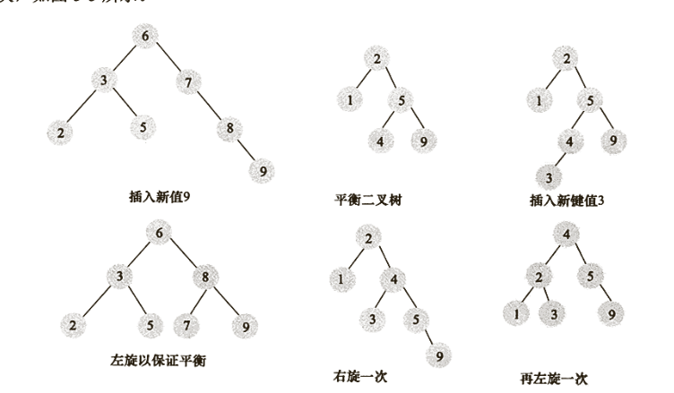
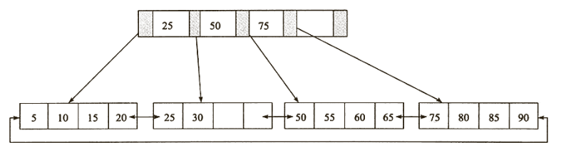
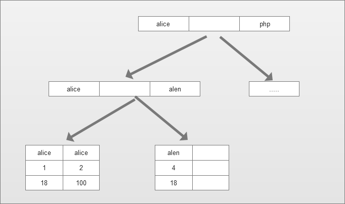
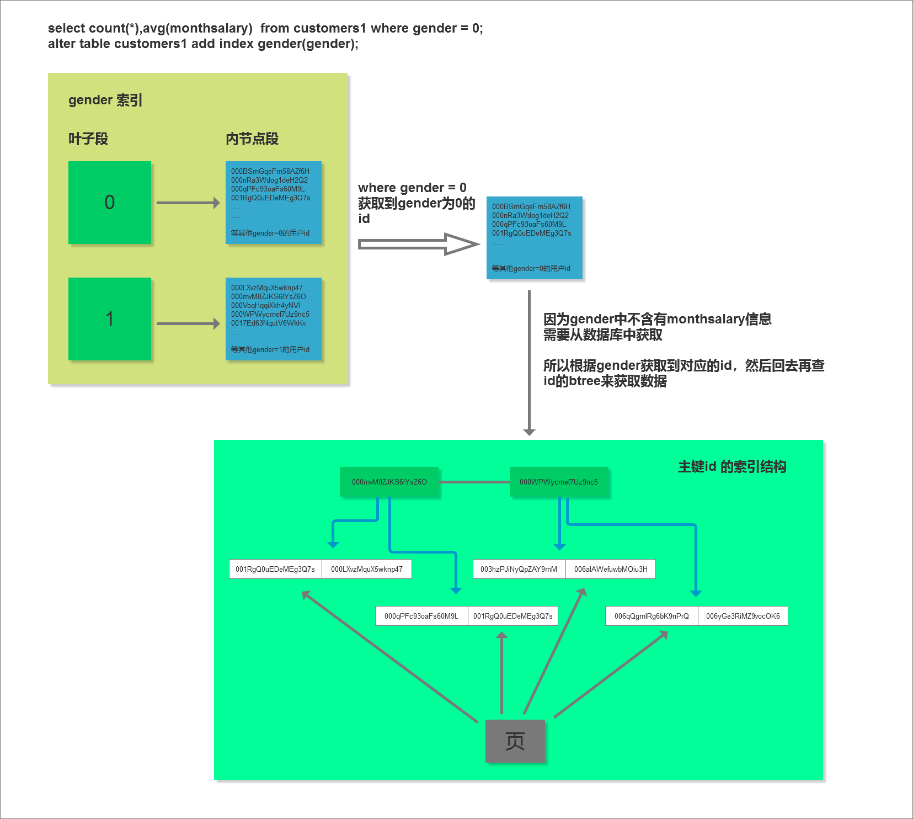
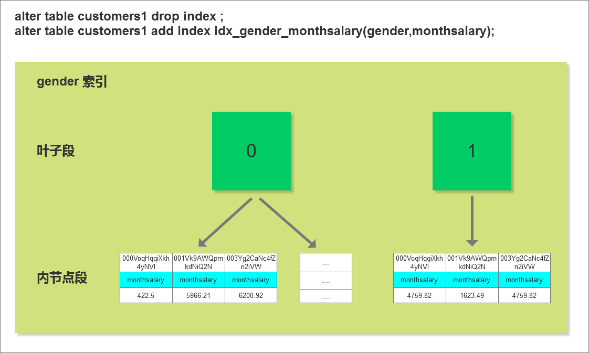
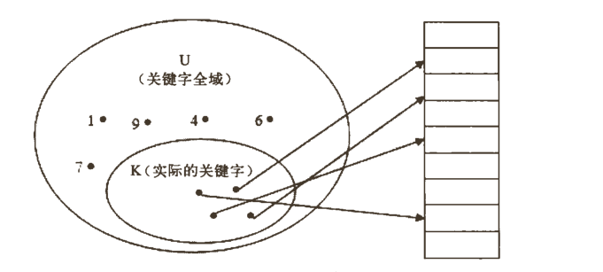
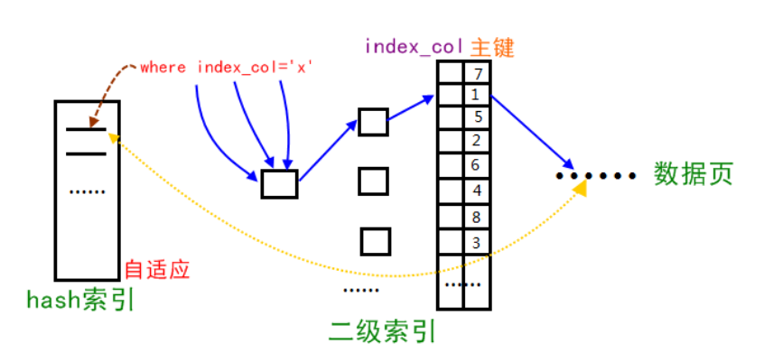

# 索引基础

### 0. 课程内容
<pre>
1. 课程回顾
   1.0 索引介绍
   1.1 二叉树算法
   1.2 SQL-IO-索引-执行流程
2. 二分查找算法与平衡二分树
3. b+tree结构
4. hash索引
5. 全文索引
6. 索引的利弊与定义
</pre>

### 1. 二分查找算法与平衡二分树
二分查找法前面简单提了一下，就是每一次查找的时候会先找中间值，然后进行值的判断，小于往左找大于往右找，因此减少查找的数量

但是实际上二叉树他有很多种方式


如上图中的方式我们也可以称之为二叉树，但是这种二叉树的方式效率比较低，不满足平衡二叉树的定义。

平衡二叉树的查找性能是比较高的，但不是最高的只是接近最高性能。平衡二叉树的维护实际上代价是非常大的。通常来说，需要1次或者更多次的左旋和右旋来得到插入或更新后树的平衡性。



### 3. B+tree的结构

B+tree是在二叉树的基础上演变来的。b+tree的定义实际上是比较的复杂的，b+tree视为磁盘或其他直接存取辅助设备设计的一种平衡查找树。在B+tree中，所有记录节点都是按键值的大小顺序存放在同一层的叶子节点上，由各叶子节点指针进行连接。

b+tree会根据指定的索引列的值排序：5,10,15,20,25,30,50,55,60,65,75,80,85,90



#### 3.1. 主索引和辅助索引
在 InnoDB 存储引擎中，每一个索引都对应一棵 B+ Tree，InnoDB 的索引主要分为主索引和辅助索引：

* 主索引：包含记录的文件按照某个 key 制定的顺序排序，这个 key 就是主索引，也就是主键，也被称为聚簇索引。因为无法同时把数据行存放在两个不同的地方，所以一个表只能有一个聚集索引。在 InnoDB 中，主索引的叶子节点存的是<font color=red>整行数据</font>，这也意味着 InnoDB 中的表一定要有一个主索引；
* 辅助索引：某个 key 指定的顺序与文件记录的物理顺序不同，这个 key 就是辅助索引。InnoDB 中的辅助索引在叶子节点中并<font color=red>不存储实际的数据，只会包含主索引的值</font>。这就意味着如果使用辅助索引进行数据的查找，只能查到主索引，然后根据这个主索引再次扫描以下主索引的树，进行一次回表操作；

InnoDB 的表中要求必须有一个主键，那么可能有人会将身份证号这种唯一性的标识作为主索引，这样就大错特错了。刚刚说到主键也被称为聚簇索引，它是要按照顺序进行排序的，要求有聚簇性。如果将身份证号作为主键，不能保证每次插入的数据都是按照身份证号的顺序进行排列的，这就使得每次主键的插入都变得完全随机，可能导致每次插入一条数据都会引起页分裂的问题（这个话题在后面会讲到）。所以在表结构定义的时候，应该使用一个具有聚集性的 key 作为主键，如果真的没有的话，可以使用一个 AUTO INCREMENT 代理键作为主索引，这样可以保证数据行是顺序写入的。__如果你真的完全没有定义主键，InnoDB 会选择一个唯一的非空索引代替，但是如果没有这样的索引，InnoDB 会隐式定义一个主键来作为聚集索引。__

联合索引的结构假设如下就是我们的数据表数据 user

| id  | name  | age | gender |
| --- | ----- | --- | ------ |
| 1   | alice | 18  | 1      |
| 2   | alice | 100 | 1      |
| 3   | php   | 100 | 1      |
| 4   | alen  | 18  | 0      |
| 5   | jim   | 18  | 1      |
| ... | ...   | ..  | ..     |

假设给age和gender建立联合索引
```sql
alter table user add index name_age(name,age);
```

那么对应的数据结构



联合索引在查询的时候，比如要找Alice，2这条记录``where name = "alice" and age = 100``

MySQL会先根据name查找到了两条数据，然后再根据age找到 id = 2的这条数据

>为什么官方建议使用自增长主键作为索引

结合B+Tree的特点，自增主键是连续的，在插入过程中尽量减少页分裂，即使要进行页分裂，也只会分裂很少一部分。并且能减少数据的移动，每次插入都是插入到最后。总之就是减少分裂和移动的频率。

插入连续的数据


插入非连续的数据


#### 3.2 回表
回表主要是因为与使用辅助索引，但是因为所需要的数据不在辅助索引中而产生的回表情况，针对于之前的SQL语句分析一下
```sql
select count(*),avg(monthsalary)  from customers1 where gender = 0;
alter table customers1 add index gender(gender);
```
在之前是给gender建立了索引，但是在使用explain 分析的是 Extra为空，在使用gender索引进行查询是大致可以分为这两个步骤

1. 从索引gender对应的b+tree中取出gender值为0的记录数据
2. 但是因为gender对应的b+tree的记录中只含有gender这个字段，而在查询中需要monthsalary，这就意味着该查询就没办法直接通过使用gender所记录的数据。这时需要把从上一步中获取到的每一条记录的id字段都到聚簇索引对应的B+树中找到完整的用户记录，也就是我们通常所说的回表，然后把完整的用户记录返回给查询用户。

索引gender会先根据gender的值进行排序，所以值为 0 的记录在磁盘中的存储是相连的，集中分布在一个或几个数据页中，我们可以很快的把这些连着的记录从磁盘中读出来，这种读取方式我们也可以称为顺序I/O

图示：



根据第1步中获取到的记录的id字段的值可能并不相连，而在聚簇索引中记录是根据id（也就是主键）的顺序排列的，所以根据这些并不连续的id值到聚簇索引中访问完整的用户记录可能分布在不同的数据页中，这样读取完整的用户记录可能要访问更多的数据页，这种读取方式我们也可以称为随机I/O。一般情况下，顺序I/O比随机I/O的性能高很多，所以步骤1的执行可能很快，而步骤2就慢一些。所以这个使用索引gender的查询有这么两个特点：

-会使用到两个B+树索引，一个二级索引，一个聚簇索引。
-访问二级索引使用顺序I/O，访问聚簇索引使用随机I/O。

<font color=red>需要回表的记录越多，使用二级索引的性能就越低，甚至让某些查询宁愿使用全表扫描也不使用二级索引</font>。比方说gender值为0的用户记录数量占全部记录数量90%以上，那么如果使用gender索引的话，有90%多的id值需要回表，这不是吃力不讨好么，还不如直接去扫描聚簇索引（也就是全表扫描）。

优化器会实现对表中的记录计算一些统计数据，然后根据这个信息判断回表的记录数，如果回表很多就可能会改为全表扫描，通常来说回表越少越好。


```sql
alter table customers1 drop index ;
alter table customers1 add index idx_gender_monthsalary(gender,monthsalary);
```

建立的联合索引customers1的数据情况如下图：



这样创建之后就成为了覆盖索引using index，对于MySQL来说就直接从索引中获取到了我们所需要的数据，不行回表以及从数据表中获取

### 4. hash索引
```sql
alter table user add index idx_hash_gender using hash(gender);
```
假设索引所使用的哈希函数是hash()那么对应的值

```sql
哈希计算       = 槽(Slot)
hash('alice') = 2414      = 指向第1行的指针
hash('php')   = sd45      = 指向第3行的指针
hash('alen')  = opo4      = 指向第4行的指针
hash('jim')   = jdks      = 指向第5行的指针
```


如上：图 MySQL根据字段值创建对应的索引然后会以零散的方式存放

* 哈希索引值包含哈希值和行指针，而不存储字段值，所以不能使用索引的值避免数据库对于行的 读取(using index)。不过访问内存中的行的速度很快，索引大部分情况下这点并不影响；
* 哈希索引数据并不是按照索引值顺序存储的，所以也就无法用于排序。
* 哈希索引不能利用部分索引来查询(联合索引的情况) =》 因为哈希索引是通过内容计算到的哈希值。
* 哈希如果遇到大量的hash值相等的时候，一些索引维护操作的代价会很高

会发现gender的索引类型还是为btree；这是innodb的特点，当前的gender可以成为自适应哈希索引；是因为完全由InnoDB自己决定，不需要DBA人为干预。它是通过缓冲池中的B+树构造而来，且不需要对整个表建立哈希索引，因此它的数据非常快

```sql
mysql> show indexes from user;
+-------+------------+-----------------+--------------+-------------+-----------+-------------+----------+--------+------+------------+
| Table | Non_unique | Key_name        | Seq_in_index | Column_name | Collation | Cardinality | Sub_part | Packed | Null | Index_type |
+-------+------------+-----------------+--------------+-------------+-----------+-------------+----------+--------+------+------------+
| user  |          0 | PRIMARY         |            1 | id          | A         |      110949 |     NULL | NULL   |      | BTREE      |
| user  |          1 | idx_hash_gender |            1 | gender      | A         |           1 |     NULL | NULL   | YES  | BTREE      |
+-------+------------+-----------------+--------------+-------------+-----------+-------------+----------+--------+------+------------+
2 rows in set (0.00 sec)
```


### 5. 全文索引(full-text)
全文索引，在MySQL5.6 之前 仅有myisam存储引擎支持，而在 __5.6及以上__ 的版本中开始innodb支持全文索引。所谓全文索引，是一种通过建立倒排索引，快速匹配文档的方式。MySQL支持三种模式的全文检索模式：
```sql
mysql> show variables like '%ft_boolean_syntax%';
+-------------------+----------------+
| Variable_name     | Value          |
+-------------------+----------------+
| ft_boolean_syntax | + -><()~*:""&| |
+-------------------+----------------+
1 row in set, 1 warning (0.00 sec)
```
#### 5.1 ngram全文解析器
ngram就是一段文字里面连续的n个字的序列。ngram全文解析器能够对文本进行分词，每个单词是连续的n个字的序列。例如，用ngram全文解析器对“生日快乐”进行分词:

```
n=1: '生', '日', '快', '乐'
n=2: '生日', '日快', '快乐'
n=3: '生日快', '日快乐'
n=4: '生日快乐'
```
```sql
添加测试数据
alter table customers add fulltext index testfulltext(name) with parser ngram;

建表的时候创建 - 例子
CREATE TABLE articles (
  id INTUNSIGNED AUTO_INCREMENT NOT NULL PRIMARY KEY,
  title VARCHAR(200),
  body TEXT,
  FULLTEXT (title,body) WITH PARSER ngram
) ENGINE=InnoDB CHARACTER SET utf8mb4;

查看数据表索引的情况
mysql> show indexes from customers;
+-----------+------------+--------------+--------------+-------------+-----------+-------------+----------+--------+------+------------+
| Table     | Non_unique | Key_name     | Seq_in_index | Column_name | Collation | Cardinality | Sub_part | Packed | Null | Index_type |
+-----------+------------+--------------+--------------+-------------+-----------+-------------+----------+--------+------+------------+
| customers |          0 | PRIMARY      |            1 | id          | A         |      992340 |     NULL | NULL   |      | BTREE      |
| customers |          1 | testfulltext |            1 | name        | NULL      |      992340 |     NULL | NULL   |      | FULLTEXT   |
+-----------+------------+--------------+--------------+-------------+-----------+-------------+----------+--------+------+------------+
2 rows in set (0.00 sec)
```

注意当我们创建索引成功之后


在该目录下除了 customers.frm 和 customers.ibd文件外还有如上的文件

1. FTS_0000000000000031_000000000000005c_INDEX_1~6.ibd这6个文件用于存储倒排索引，存储的是分词和位置以及document ID，根据分词的第一个字符值进行分区，映射到不同的文件中； 文件的命名规则为FTS_{TABLE_ID}_{INDEX_ID}_INDEX_{N}.ibd
2. FTS_0000000000000031_BEING_DELETED.ibd包含已经被删除的DOC_ID，但还没从全文索引数据中删掉； FTS_0000000000000031_DELETED_CACHE.ibd 是前者的内存缓存（但是搜索了下代码，只有当*fts_cache_t::deleted_doc_ids*被使用时，才会在sync时转储到该表中，但并没有发现任何地方使用这个对象）
3. FTS_0000000000000031_BEING_DELETED_CACHE.ibd 和 FTS_0000000000000031_BEING_DELETED.ibd，包含了已经被删除索引记录并且正在从全文索引中移除的DOC ID，前者是后者的内存版本，这两个表主要用于辅助进行OPTIMIZE TABLE时将DELETED/DELETED_CACHED表中的记录转储到其中。
4. FTS_0000000000000031_CONFIG.ibd，包含全文索引的内部信息，最重要的存储是FTS_SYNCED_DOC_ID，表示已经解析并刷到磁盘的doc id， 在崩溃恢复时，可以根据这个值判断哪些该重新解析并加入到索引cache中。

#### 5.2 普通DML及查询操作
```sql
新增

mysql> insert into customers values('13718381287318', "fsd", "长沙", 1 , "2019-06-06", 454, "xx");
Query OK, 1 row affected (0.05 sec)

mysql> set global innodb_ft_aux_table = "mysql12/customers";
Query OK, 0 rows affected (0.00 sec)

mysql> select * from information_schema.INNODB_FT_INDEX_CACHE;
+------+--------------+-------------+-----------+---------+----------+
| WORD | FIRST_DOC_ID | LAST_DOC_ID | DOC_COUNT | DOC_ID  | POSITION |
+------+--------------+-------------+-----------+---------+----------+
| fs   |      1000080 |     1000080 |         1 | 1000080 |        0 |
| sd   |      1000080 |     1000080 |         1 | 1000080 |        1 |
+------+--------------+-------------+-----------+---------+----------+
2 rows in set (0.00 sec)

不要在意数据-随机生成的测试数据


1、按自然语言搜索模式查询
mysql> SELECT * FROM customers WHERE MATCH (name) AGAINST ('实来' IN NATURAL LANGUAGE MODE) limit 0, 3;
+--------------------+-----------------+-----------+--------+------------+-------------+-------+
| id                 | name            | city      | gender | birthdate  | mobile      | photo |
+--------------------+-----------------+-----------+--------+------------+-------------+-------+
| kltWhfQU0awdDeYwHd | 电实来实来      | 城都      |      0 | 1998-06-22 | 13706101209 | NULL  |
| 00ANw1RpJpL1jdrmUv | 电实来拰        | 内蒙古    |      0 | 1984-11-27 | 13202462916 | NULL  |
| 00BTZm0b7oxoo5FYxf | 要人实来        | 河南      |      0 | 1930-07-01 | 13002025220 | xxxx  |
+--------------------+-----------------+-----------+--------+------------+-------------+-------+
3 rows in set (0.00 sec)

2、按布尔全文搜索模式查询
匹配既有实来的数据
mysql> SELECT * FROM customers WHERE MATCH (name) AGAINST ('+实来' IN BOOLEAN MODE) limit 0, 3;
+--------------------+-----------------+-----------+--------+------------+-------------+-------+
| id                 | name            | city      | gender | birthdate  | mobile      | photo |
+--------------------+-----------------+-----------+--------+------------+-------------+-------+
| kltWhfQU0awdDeYwHd | 电实来实来      | 城都      |      0 | 1998-06-22 | 13706101209 | NULL  |
| 00ANw1RpJpL1jdrmUv | 电实来拰        | 内蒙古    |      0 | 1984-11-27 | 13202462916 | NULL  |
| 00BTZm0b7oxoo5FYxf | 要人实来        | 河南      |      0 | 1930-07-01 | 13002025220 | xxxx  |
+--------------------+-----------------+-----------+--------+------------+-------------+-------+
3 rows in set (0.00 sec)

匹配既有没有实来的数据
mysql> SELECT * FROM customers WHERE MATCH (name) AGAINST ('-实来' IN BOOLEAN MODE) limit 0, 3;
Empty set (0.00 sec)

匹配相关的数据
mysql> SELECT * FROM customers WHERE MATCH (name) AGAINST ('>实来' IN BOOLEAN MODE) limit 0, 3;
+--------------------+--------------+-----------+--------+------------+-------------+-------+
| id                 | name         | city      | gender | birthdate  | mobile      | photo |
+--------------------+--------------+-----------+--------+------------+-------------+-------+
| 00ANw1RpJpL1jdrmUv | 电实来拰     | 内蒙古    |      0 | 1984-11-27 | 13202462916 | NULL  |
| 00BTZm0b7oxoo5FYxf | 要人实来     | 河南      |      0 | 1930-07-01 | 13002025220 | xxxx  |
| 01pIgTyvJKTKAtx4nr | 实来起时     | 广州      |      1 | 1923-04-04 | 13906806124 | xxxx  |
+--------------------+--------------+-----------+--------+------------+-------------+-------+
3 rows in set (0.00 sec)

```

### 6. 索引的利弊与定义

索引好处：可以提高对于数据的查询效率，降低数据库的IO城，同时也会提高排序和分组对于CPU资源的消耗

索引弊端：当创建了一个索引之后，比如table创建了一个idx_city的索引，这个时候，当数据表table内容一旦发生了改变之后，MySQL就会重新调整索引的结构，如果数据表的字段是一些字符串类型的可能调整会稍微的就一点点。并且是每一个索引都会相应的调整

#### 6.1 挑选索引-建立的一些规则
1. 索引应该刨建在搜索、排序、归组等操作所涉及的数据列上,只在输出报告里出现的数据列不是好的候选。换句话说,那些在 WHERE子句、关联检索中的FROM子句、 ORDER BY或 GROUP BY子句中出现过的数据列最适合用来创建索引。只在 SELECT关键字后面的输出列清单里出现过的数据列并不是好的候选:
```sql
select
  col_a                    - 考虑
from
  tb1 left join tb2
on
  tb1.col_b = tb1.col_c    - 推介
where
  tb1.col_b = xxx          - 推介
```

2. 尽量使用惟一化索引。数据值在数据列中的分布情况是一个很值得考虑的因素。建立在惟化数据列(即数据列中的取值各不相同)上的索引有着最好的效果;如果数据列里有很多彼此重复的值,建立在其上的索引就不会有好的效果。比如说,如果某个数据列里存放着很多各不相同的年龄值,建立在其上的索引就能把不同的数据行很好地区分开;如果某个数据列里存放的是用来表示性别的M和F两种值,建立在其上的索引恐怕就帮不上多大的忙了——如果数据值的分布比较均匀,那么,不管使用哪个值(M或F)进行搜索都会匹配到大约50%的数据行。在这种情况下, MySQL可能根本就不会使用建立在这个数据列上的索引—一当查询优化程序发现某个数据值在超过30%的数据行里都有出现的时候,它通常会放弃使用相关的索引而进行一次全表扫描。

备注：这里需要注意并不是说性别就不能创建索引，而是指不推荐单独创建索引，但是我们可以创建一个唯一的包含性别的唯一索引。比如``select count(*),avg(monthsalary)  from customers1 where gender = 0;``就可以创建一个idx_gender_monthsalary的索引。

性别相关的查询在系统中还是会比较多的并且在联合索引中加上这列没有太大的问题，所以创建索引也可以但是切记没必要单独创建一个性别的索引。不过我们还是有很多情况是不会使用到性别的比如之前题目的第二题``查询同城市的客户数量和平均月薪``

```sql
set profiling = 1;

mysql> select count(*),avg(monthsalary) from customers1 group by city;
11 rows in set (42.70 sec)

mysql> show profiles;
+----------+-------------+----------------------------------------------------------------+
| Query_ID | Duration    | Query                                                          |
+----------+-------------+----------------------------------------------------------------+
|        1 | 42.70001850 | select count(*),avg(monthsalary) from customers1 group by city |
+----------+-------------+----------------------------------------------------------------+
1 row in set, 1 warning (0.00 sec)

mysql> show profile for query 1;
+----------------------+-----------+
| Status               | Duration  |
+----------------------+-----------+
| starting             |  0.000048 |
| checking permissions |  0.000003 |
| Opening tables       |  0.000010 |
| init                 |  0.000013 |
| System lock          |  0.000005 |
| optimizing           |  0.000002 |
| statistics           |  0.000008 |
| preparing            |  0.000006 |
| Creating tmp table   |  0.000024 |
| Sorting result       |  0.000002 |
| executing            |  0.000001 |
| Sending data         | 42.699786 |
| Creating sort index  |  0.000038 |
| end                  |  0.000002 |
| query end            |  0.000005 |
| removing tmp table   |  0.000005 |
| query end            |  0.000002 |
| closing tables       |  0.000005 |
| freeing items        |  0.000044 |
| cleaning up          |  0.000012 |
+----------------------+-----------+
20 rows in set, 1 warning (0.00 sec)

会发现查询时间特别长 通过explain分析一下
mysql> explain select count(*),avg(monthsalary) from customers1 group by city;
+----+-------------+------------+------------+------+---------------+------+---------+------+---------+----------+---------------------------------+
| id | select_type | table      | partitions | type | possible_keys | key  | key_len | ref  | rows    | filtered | Extra                           |
+----+-------------+------------+------------+------+---------------+------+---------+------+---------+----------+---------------------------------+
|  1 | SIMPLE      | customers1 | NULL       | ALL  | NULL          | NULL | NULL    | NULL | 1305211 |   100.00 | Using temporary; Using filesort |
+----+-------------+------------+------------+------+---------------+------+---------+------+---------+----------+---------------------------------+
1 row in set, 1 warning (0.00 sec)

全表扫描，并没有使用到相应的索引idx_gender_monthsalary

mysql> show index from customers1;
+------------+------------+------------------------+--------------+-------------+-----------+-------------+----------+--------+------+
| Table      | Non_unique | Key_name               | Seq_in_index | Column_name | Collation | Cardinality | Sub_part | Packed | Index_type
+------------+------------+------------------------+--------------+-------------+-----------+-------------+----------+--------+------+
| customers1 |          0 | PRIMARY                |            1 | id          | A         |     1305211 |     NULL | NULL   | BTREE
| customers1 |          1 | idx_gender_monthsalary |            1 | gender      | A         |           1 |     NULL | NULL   | BTREE
| customers1 |          1 | idx_gender_monthsalary |            2 | monthsalary | A         |      954070 |     NULL | NULL   | BTREE
+------------+------------+------------------------+--------------+-------------+-----------+-------------+----------+--------+------+
3 rows in set (0.00 sec)

但是我们可以通过一个技巧给这个操作使用上idx_gender_monthsalary这个索引改写一下SQL

mysql> select count(*),avg(monthsalary) from customers1 where gender in (0, 1)  group by city;
11 rows in set (24.14 sec)

mysql> explain  select count(*),avg(monthsalary) from customers1 where gender in (0, 1)  group by city;
+----+-------------+------------+------------+------+------------------------+------+---------+------+---------+----------+----------------------------------------------+
| id | select_type | table      | partitions | type | possible_keys          | key  | key_len | ref  | rows    | filtered | Extra                                        |
+----+-------------+------------+------------+------+------------------------+------+---------+------+---------+----------+----------------------------------------------+
|  1 | SIMPLE      | customers1 | NULL       | ALL  | idx_gender_monthsalary | NULL | NULL    | NULL | 1305211 |   100.00 | Using where; Using temporary; Using filesort |
+----+-------------+------------+------------+------+------------------------+------+---------+------+---------+----------+----------------------------------------------+
1 row in set, 1 warning (0.06 sec)

可以看到感觉得到效率是有一定的提升；这主要因为查询的条件不限制性别，我们可以通过增加where gender in (1,0)的方法来让MySQL选择索引，这样并不会过滤任何行。不过上面的方法也是有一定的问题，就是in()列表太长就不是很合适。

这个案例显示了一个基本原则:考虑表上所有的选项。当设计索引时,不要只为现有的査询考虑需要哪些索引,还需要考虑对査询进行优化。如果发现某些查询需要创建新索引,但是这个索引又会降低另一些查询的效率,那么应该想一下是否能优化原来的查询。应该同时优化查询和索引以找到最佳的平衡,而不是闭门造车去设计最完美的索引。

但是我们可以修改一下这个索引改为(gender,city,monthsalary)
alter table customers1 drop index idx_gender_monthsalary;
alter table customers1 add index idx_gender_city_monthsalary(gender,city,monthsalary);

mysql> explain  select count(*),avg(monthsalary) from customers1 group by city;
+----+-------------+------------+------------+-------+-----------------------------+-----------------------------+---------+------+---------+----------+----------------------------------------------+
| id | select_type | table      | partitions | type  | possible_keys               | key                         | key_len | ref  | rows    | filtered | Extra                                        |
+----+-------------+------------+------------+-------+-----------------------------+-----------------------------+---------+------+---------+----------+----------------------------------------------+
|  1 | SIMPLE      | customers1 | NULL       | index | idx_gender_city_monthsalary | idx_gender_city_monthsalary | 38      | NULL | 1305211 |   100.00 | Using index; Using temporary; Using filesort |
+----+-------------+------------+------------+-------+-----------------------------+-----------------------------+---------+------+---------+----------+----------------------------------------------+
1 row in set, 1 warning (0.00 sec)

mysql> select count(*),avg(monthsalary) from customers1 group by city;
11 rows in set (1.01 sec)

试试之前的第一题
mysql> select count(*),avg(monthsalary) from customers1 where gender =0;
+----------+------------------+
| count(*) | avg(monthsalary) |
+----------+------------------+
|   651457 |      5004.957393 |
+----------+------------------+
1 row in set (0.17 sec)

mysql> explain select count(*),avg(monthsalary) from customers1 where gender =0;
+----+-------------+------------+------------+------+-----------------------------+-----------------------------+---------+-------+--------+----------+-------------+
| id | select_type | table      | partitions | type | possible_keys               | key                         | key_len | ref   | rows   | filtered | Extra       |
+----+-------------+------------+------------+------+-----------------------------+-----------------------------+---------+-------+--------+----------+-------------+
|  1 | SIMPLE      | customers1 | NULL       | ref  | idx_gender_city_monthsalary | idx_gender_city_monthsalary | 1       | const | 652605 |   100.00 | Using index |
+----+-------------+------------+------------+------+-----------------------------+-----------------------------+---------+-------+--------+----------+-------------+
1 row in set, 1 warning (0.00 sec)

不影响很成功nice

扩展与思考点

mysql> select count(*),avg(monthsalary) from customers1 where city = "长沙";
+----------+------------------+
| count(*) | avg(monthsalary) |
+----------+------------------+
|   118118 |      5006.662243 |
+----------+------------------+
1 row in set (0.27 sec)

mysql> select count(*),avg(monthsalary) from customers1 where gender in (1,0) and city = "长沙";
+----------+------------------+
| count(*) | avg(monthsalary) |
+----------+------------------+
|   118118 |      5006.662243 |
+----------+------------------+
1 row in set (0.06 sec)
```

3. 尽量对比较短的值进行索引。当对一个字符串数据列进行索引的时候,只要有可能,就应该指定一个前缀长度。比如说,假设有一个CHAR(200)数据列,那么,如果大多数数据值的前10个或前20个字节是彼此不同的,就不要对整个数据列进行索引——只对前10个或前0个字节进行索引可以节省大量的空间,而且会使查询进行得更快。比较短的索引需要的磁盘IO操作比较少,对它们进行比较的速度也更快。更重要的是,键值越短,索引缓存区里容纳的键值也就越多;而 MySQL同时保存在内存里的索引项越多,索引缓存区的命中率也就越高。(当然,你也得有点常识。如果只对数据列的第一个字符进行索引,它的用处就可能没有这么大,因为能够用这个索引区分开来的数据值并没有多少。)

扩展点：表页的带下限定了表行的最大长度。通常，一个表行必须要能够存入一个表页中，一个索引行也必须能够存入一个叶子页中。如果一张表的平均行长大于表页大小的三分之一，那么空间利用率讲很糟糕。比如：一个4kb的页只能存储一个长度为2100字节的行。无法利用的课件问题对于索引更为严重。由于新的所银行必须根据索引建的值放在相应的某个叶子页中，因此在加载和重组后许多索引的长度大于叶子页大小的20%，就有可能造成糟糕的空间利用和频繁的叶子页分裂。

InnoDB在读记录的变长字段长度列表时先查看表结构，如果某个变长字段允许存储的最大字节数大于255时，该怎么区分它正在读的某个字节是一个单独的字段长度还是半个字段长度呢？设计InnoDB的大叔使用该字节的第一个二进制位作为标志位：如果该字节的第一个位为0，那该字节就是一个单独的字段长度（使用一个字节表示不大于127的二进制的第一个位都为0），如果该字节的第一个位为1，那该字节就是半个字段长度。 对于一些占用字节数非常多的字段，比方说某个字段长度大于了16KB，那么如果该记录在单个页面中无法存储时，<font color=red>InnoDB会把一部分数据存放到所谓的溢出页中（我们后边会唠叨），在变长字段长度列表处只存储留在本页面中的长度，所以使用两个字节也可以存放下来</font>。

其余的百度一下就行了、
